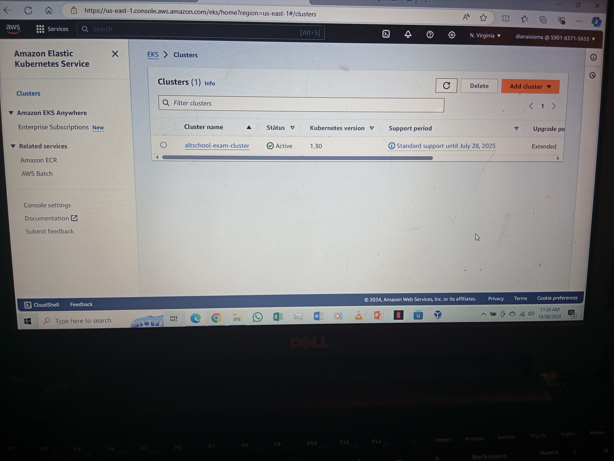
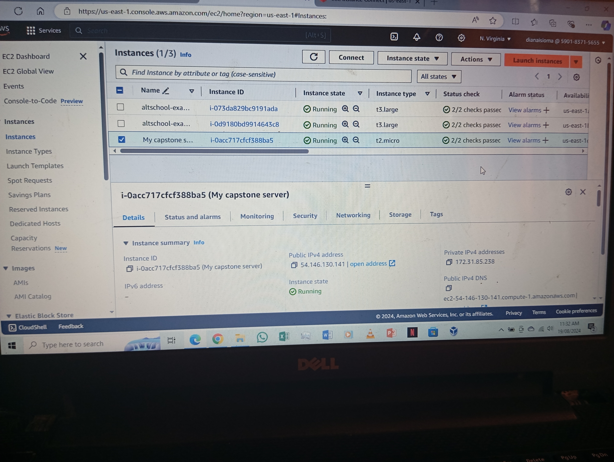
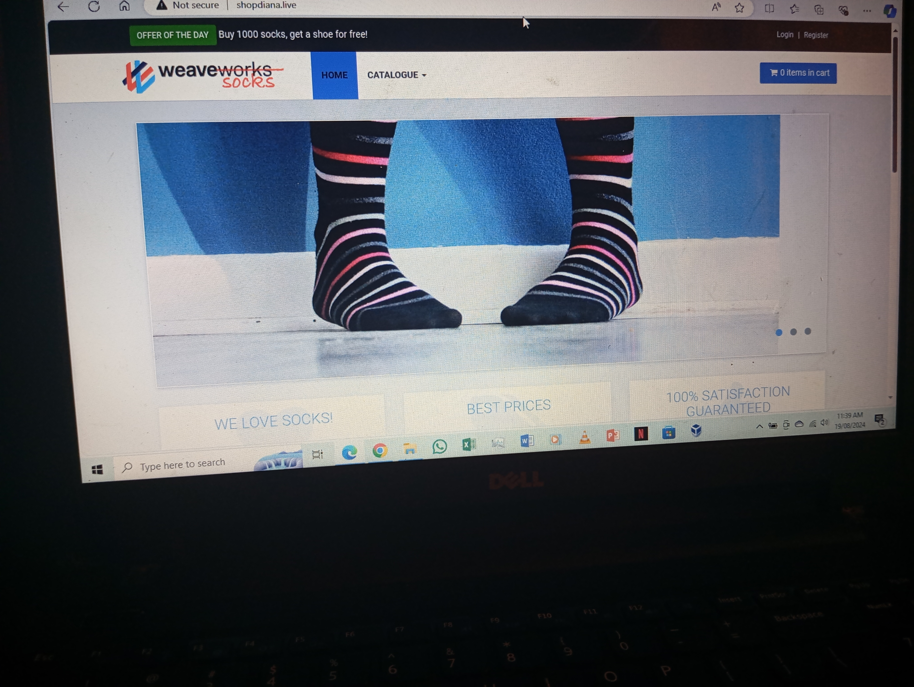
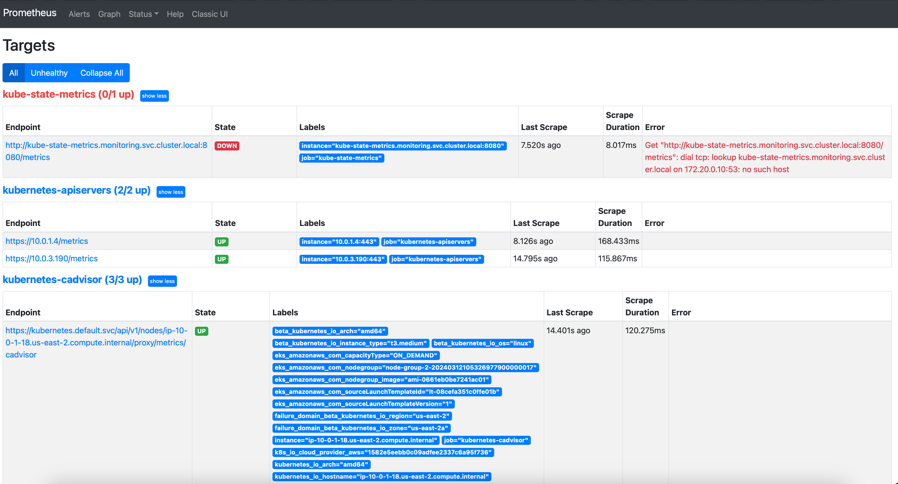
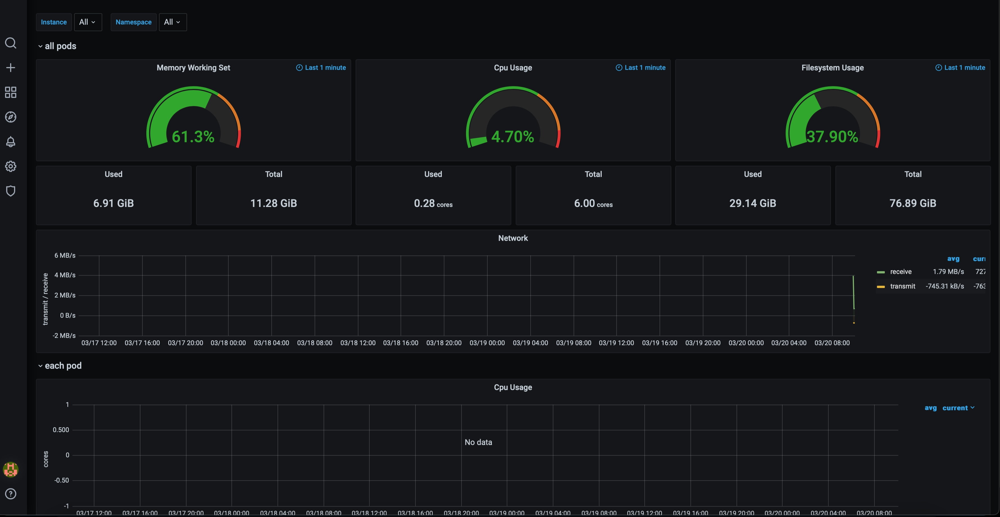
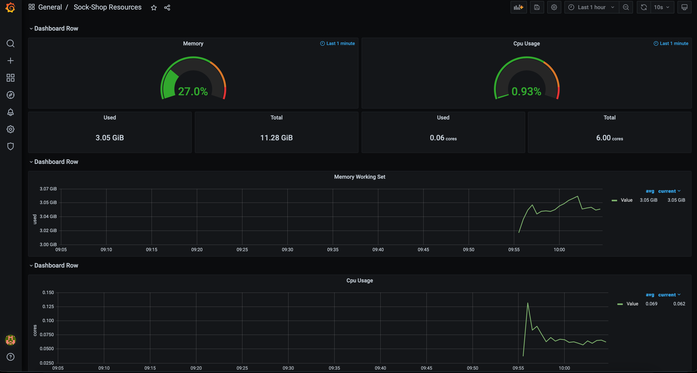
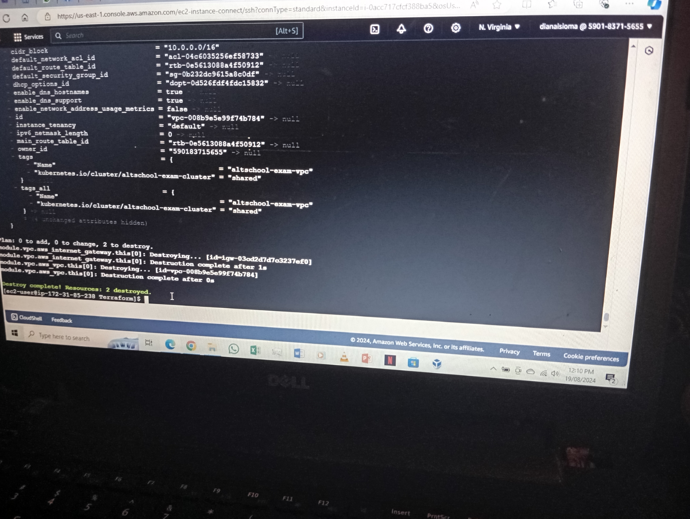

# Deploy the Sock-shop Microservice on the kubernetes cluster using Infrastructure as code (IAC). 

## **Expectation** 

Run an application on Kubernetes with HTTPS enabled, using Prometheus for monitoring, Grafana for logging, and Alert-manager for metrics. Utilize Ansible or Terraform for configuration management, and choose an IaS provider of your choice. 

<br> 

## The steps taken to achieve the above are as follows: 

1. Initialize terraform in your root directory by running: 
```sh
terraform init
``` 


2. Then run the command: 
```sh
terraform plan
```


3. Afterwards, do terraform apply to set up the kubernetes cluster on the cloud provider by:  
```sh
terraform apply
```
 
 

4. Now that we have created our cluster, we need to update our kubeconfig, else we won't be able to communicate with the cluster: 
```
aws eks update-kubeconfig --region us-east-1 --name altschool-exam-cluster
```
<br> 

5. Use the command below to apply the deployment manifests to the cluster:
```
kubectl apply -f ./k8s-manifests/
``` 


6. To view all the resources deployed in the altschool-exam-cluster, use the following command:
```
kubectl get all -A
```
<br> 

7. Let's access our application in the browser. As you can see, it's rendering the sock-shop through my domain. 

 

<br> 

## **Monitoring (Prometheus)** 
 
 
<br> 

## **Logging (Grafana)** 
 
<br> 

## **Note:**
EKS is very costly, so I used the below command to remove all resources created with Terraform. 
```sh
terraform destroy
```

